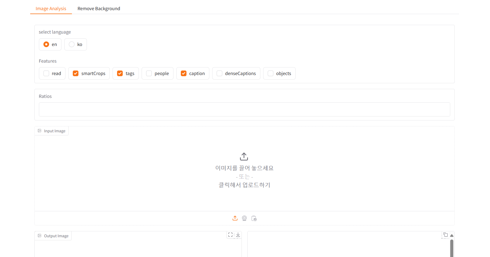
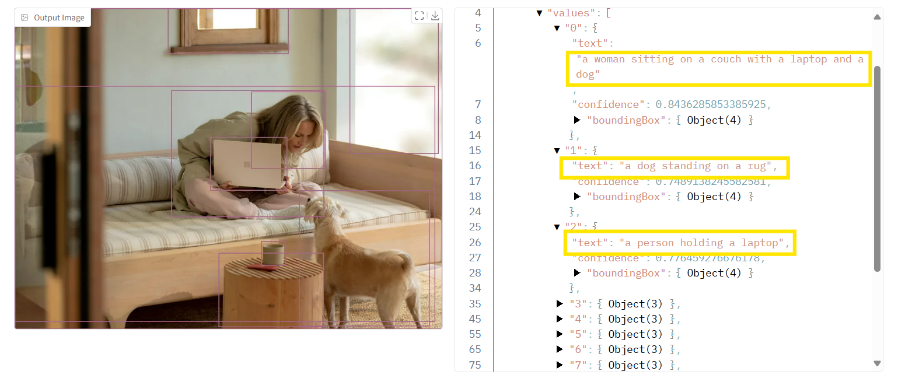
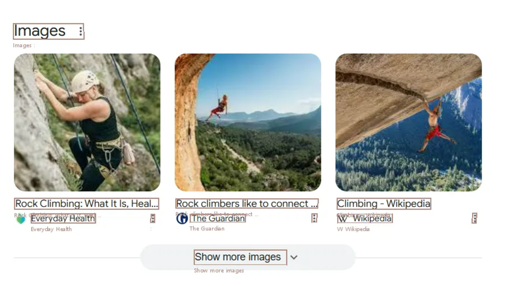
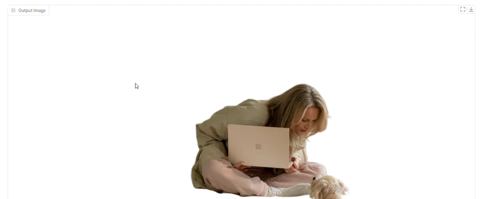

# Vision Analysis and Background Removal with Gradio

This project is a Python-based web application that leverages **Azure Cognitive Services** to perform image analysis and background removal. Built with **Gradio**, the application provides an intuitive interface for exploring features like object detection, text extraction, and smart cropping.

<br>

## Features

- **Image Analysis**
  - Detect objects, tags, and people in images.
  - Generate captions and dense captions for images.
  - Perform smart cropping with custom aspect ratios.<br>
  <br>
  <br>

- **Background Removal**
  - Remove the background or apply foreground matting to images.<br>
 <br>

- **Dynamic User Interface**
  - Change language settings dynamically.
  - Display Smart Crops parameters only when applicable.

## Tech Stack

- **Python**: Core programming language.
- **Gradio**: Web interface framework.
- **Azure Cognitive Services**: Vision API for image analysis.
- **Pillow (PIL)**: Image processing library.
- **Requests**: HTTP library for API calls.

## Project Structure

```project_directory/
    ├── main.py                 # Gradio UI and event handling
    ├── vision.py               # Vision API-related functions
    ├── background_removal.py   # Background removal API functions
    ├── drawing.py              # Image processing and drawing functions
    ├── constants.py            # Shared constants like features and language codes
    ├── requirements.txt        # Python dependencies
    ├── .gitignore              # Files and folders to exclude from version control
    ├── README.md               # Project documentation
```

## Installation

1. Clone the repository:
    ```bash
    git clone https://github.com/jihyeon26/ai_vision.git
    cd <your-repository-name>
    ```

2. Install the required dependencies:
    ```bash
    pip install -r requirements.txt
    ```

3. Set up the .env file with your Azure Cognitive Services API credentials:
    ```plaintext
    API_KEY=your_api_key_here
    VISION_ENDPOINT=https://<your-region>.api.cognitive.microsoft.com/computervision/imageanalysis:analyze?
    SEGMENT_ENDPOINT=https://<your-region>.api.cognitive.microsoft.com/computervision/imageanalysis:segment?
    ```

## Usage
1. Run the application:
    ```bash
    python main.py
    ```
2. Open the Gradio interface in your web browser.

3. Explore the tabs:
  - Image Analysis: Upload an image, select features, and view the analysis results.
  - Remove Background: Upload an image and choose a background removal mode.
